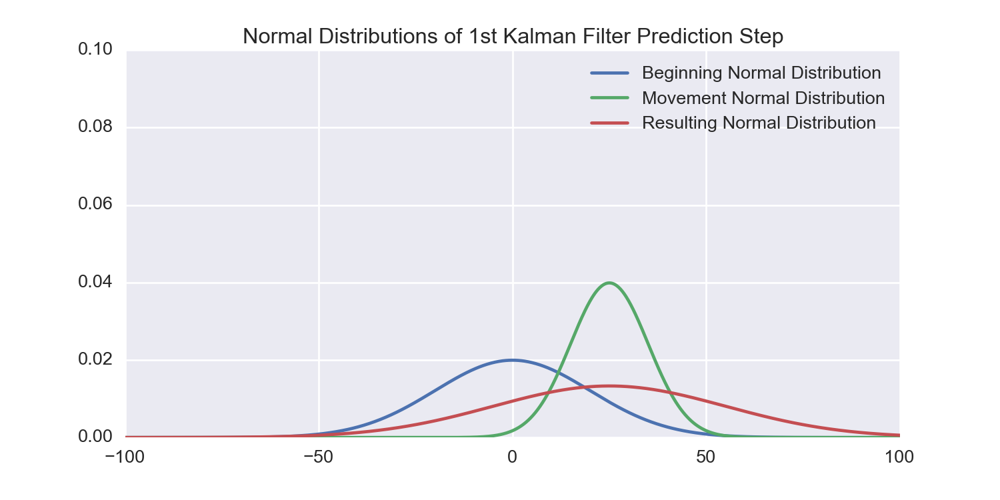

# PyData 2014 Berlin
## IPython and Sympy to Develop a Kalman Filter for Multisensor Data Fusion
~ Paul Balzer ~

The best filter algorithm to fuse multiple sensor informations is the Kalman filter. To implement it for non-linear dynamic models (e.g. a car), analytic calculations for the matrices are necessary. In this talk, one can see, how the IPython Notebook and Sympy helps to develop an optimal filter to fuse sensor information from different sources (e.g. acceleration, speed and GPS position) to get an optimal estimate.

## Topics

### 1. Sensor Noise

A very basic introduction to sensor noise and how to describe them statistically.

You need to download and run this [IPython Notebook]() locally, to see the interactive elements.

### 2. Kalman Filter in 1D

Basic introduction to the theory behind the filter algorithm in just one dimension.

You need to download and run this [IPython Notebook]() locally, to see the interactive elements.

### 3. Multi-Dimensional Kalman Filter

Now we are going multi-dimensional with matrices.

[IPython Notebook]()

### 4. Extended Kalman Filter for nonlinear dynamics

This is actually a real life example, which fuses GPS measurements and IMU measurements of a real vehicle.

[IPython Notebook]()

## Video

*coming soon...*

## Presentation

`Presentation.html` is made with [cleaver](https://github.com/jdan/cleaver): Simply `cleaver Presentation.md`
